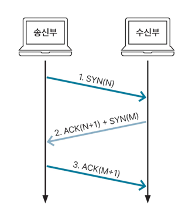
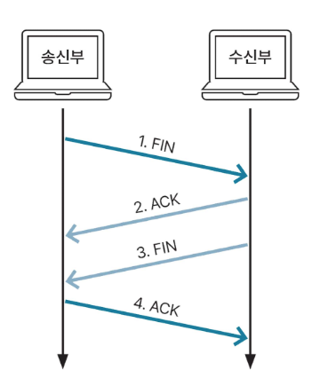

## 핸드 셰이킹

핸드 셰이킹은 TCP 송신부와 수신부가 데이터를 주고받기 전에 연결을 설정하는 과정을 의미합니다.  
서로 통신이 가능한 상태인지 확인하고, 데이터 전송을 준비하는 과정입니다.  

## 2-way 핸드 셰이킹

하나의 SYN 요청, 하나의 ACK 응답만 존재합니다.  
서버와 클라이언트가 서로의 상황을 모르기 때문에 문제가 발생합니다.(2-way Handshake를 사용하지 않는 이유)  

## 2-way 핸드 셰이킹 동작 과정
1. Client → SYN → Server  
클라이언트가 서버에게 연결을 요청함
SYN 패킷을 전송함
서버는 SYN 패킷을 받고 ESTABLISHED 상태가 됨

2. Server → ACK → Client  
서버는 연결 수락 및 응답 패킷을 전송함
ACK 패킷을 전송함
클라이언트는 ACK 패킷을 받고 ESTABLISHED 상태가 됨

## 3-way 핸드 셰이킹

TCP에서 송신부(클라이언트)와 수신부(서버)가 데이터를 주고받기 전에 **안정적인 연결을 설정하는 과정**입니다.

## 3-way 핸드 셰이킹 과정

1.  송신부가 수신부와 연결하기 위해서 **SYN(N)이라는 메시지**를 보내게 됩니다. 이때 임의의 숫자인 N과 함께 보내게 됩니다. 송신부는 수신부로 응답이 오기 전에는 SYN_SENT(연결 요청을 보냈지만, 아직 서버의 응답을 기다리고 있는 상태) 상태가 됩니다.  

2. 수신부가 송신부로부터 SYN 메시지를 받으면, 연결 요청을 허락한다는 의미인 **ACK 메시지**를 전송합니다. 이때, 수신부는 전 단계에서 송신부로부터 받은 임의의 숫자 N에 1을 더한 N+1의 값을 함께 보내게 됩니다. 추가로, SYN 메시지에 임의의 숫자 M을 함께 보내고 송신부의 응답을 기다리게 됩니다. 이때 수신부는 SYN_RECEIVED(연결 요청을 승인했지만, 아직 송신부의 최종 확인[ACK]을 기다리는 상태) 상태가 됩니다.  

3. 송신부가 수신부로부터 **ACK + SYN 메시지**를 받는 경우, 연결이 성립된다는 의미인 **established 상태**가 됩니다. ACK + SYN 메시지에 대한 응답으로 ACK 메시지와 이전 단계에서 받은 임의의 숫자 M에 1을 더한 M+1 값을 함께 보냅니다. 이때, ACK 메시지에는 송신부에서 전송하려는 데이터가 포함될 수 있습니다. 최종적으로 송신부로부터 ACK 메시지를 받은 수신부도 established 상태가 됩니다.  

## 3-way 핸드 셰이킹 과정에 사용되는 헤더 필드

### Sequence Number  
TCP 세그먼트의 연속된 데이터 번호로, 첫 번째 바이트의 바이트 스트림 번호입니다.
TCP는 데이터를 단지 순서대로 정렬되어 있는 바이트 스트림으로 봅니다.

**ISN(Initial Sequence Number)**  
처음에 클라이언트가 서버로 보내는 SYN(Sequence Number)로, 랜덤한 난수로 지정된 시퀀스 번호압니다.  

### Acknowlegement Number
상대방으로부터 받아야하는 다음 TCP 세그먼트 데이터 번호입니다.  

### Control bits(Flag)
SYN(Synchronize Sequence Number)  
연결을 요청할 때 SYN bit을 사용합니다.  
연결을 요청하는 경우 SYN bit을 1로 설정, 다른 모든 경우엔 SYN bit을 0으로 설정합니다.  

ACK(Acknowledge)  
패킷을 받았다는 것을 의미하는 flag 입니다.  
최초 연결 과정에서 전송되는 첫 번째 세그먼트를 제외한 모든 세그먼트의 ACK는 1로 설정합니다.  

### 2-way 핸드 쉐이킹을  사용하지 않고, 3-way 핸드 쉐이킹을 사용하는 이유  
ISN 동기화가 이루어지지 않고(패킷 손실 & 지연 탐지 불가, 작업 순서 달라져 오류 발생 및 작업의 중복 수행), half open connection(한 쪽 Host만 연결된 상태) 상황이 발생할 수 있기 때문입니다.  

## 4-way 핸드 셰이킹

**TCP 연결을 종료할 때 사용**하는 방식입니다.  4단계 과정을 통해 연결을 해제하게 됩니다.  

## 4-way 핸드 셰이킹 과정
  

1. 송신부가 수신부와 연결을 종료하기 위해, FIN 메시지를 보내게 됩니다.  이때 송신부는 FIN_WAIT1 상태가 됩니다.  

2. 수신부가 송신부로부터 FIN 메시지를 받으면 응답값으로 ACK를 보냅니다. 이때 수신부는 CLOSE_WAIT상태가 됩니다. 수신부는 메시지를 보낸 후, 애클리케이션을 종료하는 등 연결을 종료하기 위한 작업을 합니다.  송신부는 수신부에서 보낸 ACK 메시지를 받고, FIN_WAIT2 상태가 됩니다.  

3. 수신부에서 연결을 종료할 준비가 되면, 송신부에 FIN메시지를 보내고, LAST_WAIT 상태가 됩니다.  

4. 송신부는 서버로부터 받은 FIN 메시지에 응답하기 위해서 ACK 메시지를 보내고 TIME_WAIT 상태가 됩니다. 이 상태에서 일정 시간이 지나게 되면 CLOSED 상태가 됩니다.  수신부는 송신부로부터 ACK 메시지를 받고, CLOSED 상태가 됩니다.  

### 4번째 과정에서 송신부가 바로 CLOSED 되지 않고, TIME_WAIT이 발생하는 이유
FIN 메시지 이전에 보낸 패킷이 FIN 메시지 수신보다 지연되어 발생하는 패킷 유실에 대비하고, 수신부에 ACK 메시지가 제대로 전달되지 않아 연결 해제가 이뤄지지 않는 경우도 대비하기 위해서 입니다.

## Flag 종류

TCP 헤더엔 커넥션의 상태를 나타내는 필드가 있습니다. 총 9비트로 구성되고 각각 비트는 의미하는 바가 다릅니다.  
 

| 비트     | 플래그 이름 | 설명                               | 개요                                   |
|--------|--------|----------------------------------|--------------------------------------|
| 1번째 비트 | NS    |     | CWR, ECE 필드가 실수나 악의적으로 은폐되는 경우를 막기위한 플래그 |
| 2번째 비트 | CWR    | Congestion Window Reduced        | ECN-Echo에 따라, 혼잡 윈도우가 줄어든 것을 알리는 플래그 |
| 3번째 비트 | ECE    | ECN-Echo                         | 혼잡이 발생한 것을 통신 상대에게 알리는 플래그           |
| 4번째 비트 | URG    | Urgent Pointer field significant | 긴급을 나타내는 플래그                         |
| 5번째 비트 | ACK    | Acknowledgment field significant | 확인 응답을 나타내는 플래그                      |
| 6번째 비트 | PSH    | Push Function                    | 빠르게 애플리케이션에 데이터를 전달하는 플래그            |
| 7번째 비트 | RST    | Reset the connection             | 커넥션을 강제로 끊는 플래그                      |
| 8번째 비트 | SYN    | Synchronize sequence numbers     | 커넥션을 여는 플래그                          |
| 9번째 비트 | FIN    | No more data from sender         | 커넥션을 닫는 플래그                          |

이 컨트롤 비트를 사용해 해당 패킷이 ACK, SYN, FIN 인지 확인 할 수 있습니다.  

 