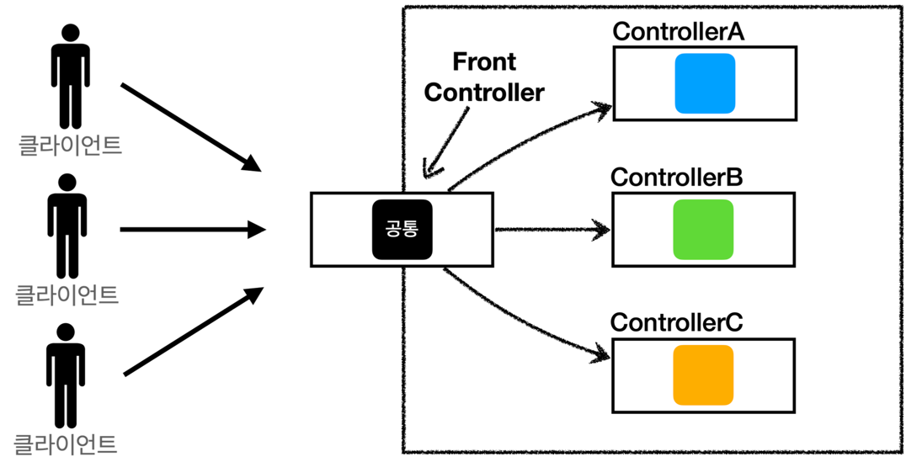
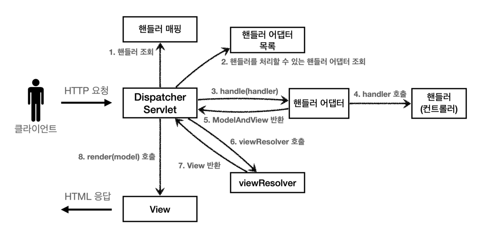

# 스프링 MVC의 핵심: DispatcherServlet

스프링 MVC에서 중심 역할을 하는 **DispatcherServlet**과 관련 개념들에 대해 설명합니다. 주요 내용은 다음과 같습니다
- DispatcherServlet이란?
- 상속 구조
- 프론트 컨트롤러 패턴
- 어댑터 패턴 (Adapter Pattern)
- 디스패처 서블릿의 동작 과정
- 디스패처 서블릿의 동작 과정(@RestController)
- 디스패처 서블릿 설정 방법

---

## DispatcherServlet이란?

- **정의:**  
  클라이언트의 HTTP 요청을 가장 먼저 받아 적합한 컨트롤러에 위임하는 **프론트 컨트롤러**입니다.

- **주요 역할:**
    - 모든 HTTP 요청의 공통 작업(요청 분석, 모델 준비, 뷰 선택 등)을 처리합니다.
    - 각 요청에 맞는 컨트롤러로 요청을 위임합니다.

- **효과:**  
  모든 요청을 한 곳에서 관리하므로, 여러 서블릿을 별도로 관리할 필요가 없어집니다.

---

## 상속 구조

DispatcherServlet은 다음과 같은 계층 구조를 가집니다:

DispatcherServlet ➡ FrameworkServlet ➡ HttpServletBean ➡ HttpServlet ➡ GenericServlet ➡ Servlet

- **DispatcherServlet**은 **FrameworkServlet**을 상속하며, 최종적으로 HttpServlet의 기능을 포함하고 있습니다.

---

## 프론트 컨트롤러 패턴



### 도입 배경
- 여러 컨트롤러에 중복되는 공통 작업을 한 곳에서 처리하기 위해 사용됩니다.
- 공통 로직(예: 인증, 요청 로깅 등)을 분리해 코드의 재사용성을 높입니다.

### 특징
- 모든 요청이 DispatcherServlet을 통해 처리됩니다.

- 요청 분석, 인증, 로깅 등 공통적인 작업을 중앙에서 처리합니다.

- 요청에 맞는 컨트롤러를 찾아 위임하며, 개별 컨트롤러는 비즈니스 로직에 집중할 수 있습니다.

---

## 어댑터 패턴 (Adapter Pattern)

### 도입 배경
- 스프링 MVC는 다양한 형태의 컨트롤러 인터페이스를 지원합니다.
- 서로 다른 인터페이스를 가진 컨트롤러들을 일관되게 호출하기 위해 어댑터 패턴을 사용합니다.

### 특징
- 기존 클래스를 수정하지 않고도 서로 다른 인터페이스와 연동할 수 있도록 도와줍니다.

- 스프링 MVC의 `HandlerAdapter` 인터페이스는 다양한 컨트롤러를 지원하여 DispatcherServlet이 여러 컨트롤러를 호출할 수 있도록 합니다.

### 처리 과정

1. **핸들러 매핑:** 요청에 맞는 컨트롤러(핸들러)를 조회합니다.
2. **어댑터 선택:** 해당 컨트롤러를 실행할 수 있는 `HandlerAdapter`를 조회합니다.
3. **핸들러 실행:** 어댑터를 통해 컨트롤러를 실행하고, 결과로 `ModelAndView`를 반환받습니다.
4. **뷰 처리:** ViewResolver가 View를 결정하여 최종 응답을 생성합니다.

---

## 디스패처 서블릿의 동작 과정



1. **요청 수신:** 클라이언트의 HTTP 요청이 DispatcherServlet에 도착합니다.

2. **핸들러 매핑:** 요청 URL에 따라, 적절한 컨트롤러를 조회합니다.

3. **핸들러 어댑터 조회:** 조회한 컨트롤러를 실행할 수 있는 핸들러 어댑터를 찾습니다.

4. **핸들러 실행:** 선택된 어댑터를 통해 실제 컨트롤러 메서드를 호출합니다.
    - 컨트롤러는 보통 `ModelAndView` 객체를 반환합니다.

5. **뷰 처리:** 반환된 View 이름을 기반으로 ViewResolver가 적합한 View를 찾고,
   모델 데이터를 View에 전달하여 최종 응답을 생성합니다.

6. **응답 전송:** 최종 생성된 View 또는 응답 데이터가 클라이언트에 전송됩니다.

---

## 디스패치 서블릿 동작 과정 (@RestController)

Spring MVC에서 @RestController를 사용할 때의 요청 처리 과정을 단계별로 설명합니다.

1. **요청 수신:**  
   클라이언트의 HTTP 요청이 DispatcherServlet에 도착합니다.

2. **핸들러 매핑:**  
   요청 URL 및 HTTP 메서드에 따라, 적절한 컨트롤러(즉, @RestController의 메서드)를 조회합니다.

3. **핸들러 어댑터 조회:**  
   조회한 컨트롤러를 실행할 수 있는 핸들러 어댑터를 찾습니다.

4. **핸들러 실행:**  
   선택된 어댑터를 통해 실제 컨트롤러 메서드를 호출합니다.
    - @RestController의 메서드는 보통 `ModelAndView` 대신 객체(예: DTO, Map, List 등)를 반환합니다.

5. **응답 처리 (HttpMessageConverter):**  
   반환된 객체는 HttpMessageConverter에 의해 자동으로 직렬화되어,  
   클라이언트가 요청한 미디어 타입(보통 JSON 또는 XML)으로 변환됩니다.

6. **응답 전송:**  
   직렬화된 데이터가 HTTP 응답 본문에 작성되어 클라이언트에 전송됩니다.
---

## 디스패처 서블릿 설정 방법

디스패처 서블릿을 설정하는 방법은 두 가지가 있습니다.

### 1. web.xml에 선언하는 방법

```xml
<web-app>
    <servlet>
        <servlet-name>example</servlet-name>
        <servlet-class>org.springframework.web.servlet.DispatcherServlet</servlet-class>
        <load-on-startup>1</load-on-startup>
    </servlet>

    <servlet-mapping>
        <servlet-name>example</servlet-name>
        <url-pattern>*.form</url-pattern>
    </servlet-mapping>
</web-app>
```

### 2. @WebServlet 애노테이션 사용 방법
```java
@WebServlet(name = "helloServlet", urlPatterns = "/hello")
public class HelloServlet extends DispatcherServlet {
}
```
- DispatcherServlet을 상속한 클래스를 만들고, @WebServlet 애노테이션을 통해 URL 패턴을 지정합니다.